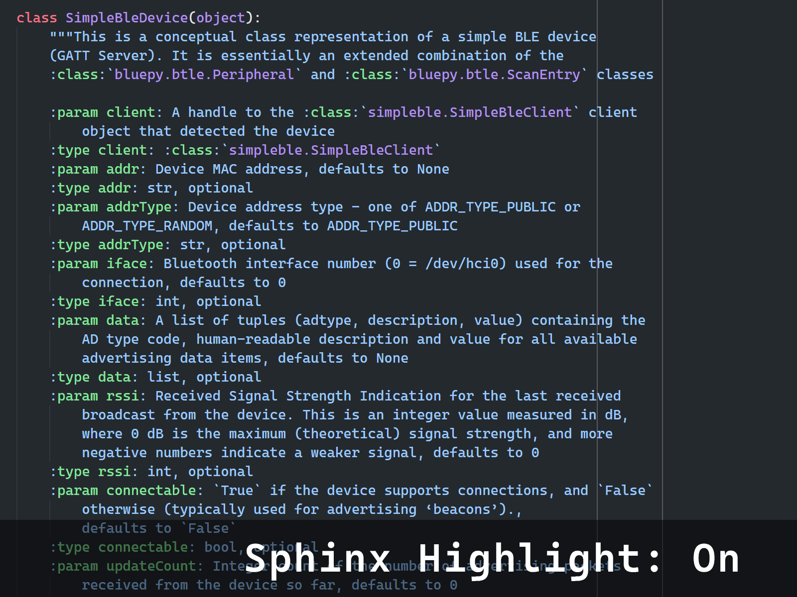

# Python Sphinx Highlighter

This is an extension for [Visual Studio Code](https://code.visualstudio.com/) designed to improve readbility of [Python](https://www.python.org/) docstrings using the the [Sphinx docstring format](https://sphinx-rtd-tutorial.readthedocs.io/en/latest/docstrings.html).

## Features

*The source code shown is the the example from the [Read the Docs Sphinx docstring format](https://sphinx-rtd-tutorial.readthedocs.io/en/latest/docstrings.html#an-example-class-with-docstrings) introduction.*

Sphinx docstrings are compact and can easily be converted into HTML or PDF documentation using [Sphinx](https://www.sphinx-doc.org/) and its [Autodoc extension](https://www.sphinx-doc.org/en/master/usage/quickstart.html#autodoc), but are generally harder to work with in the source code.

This extension alleviates this drawback by highlighting select Sphinx and [reStructuredText](https://docutils.sourceforge.io/rst.html) directives within Python docstrings.

## Release Notes

### 0.1.0

Initial release
